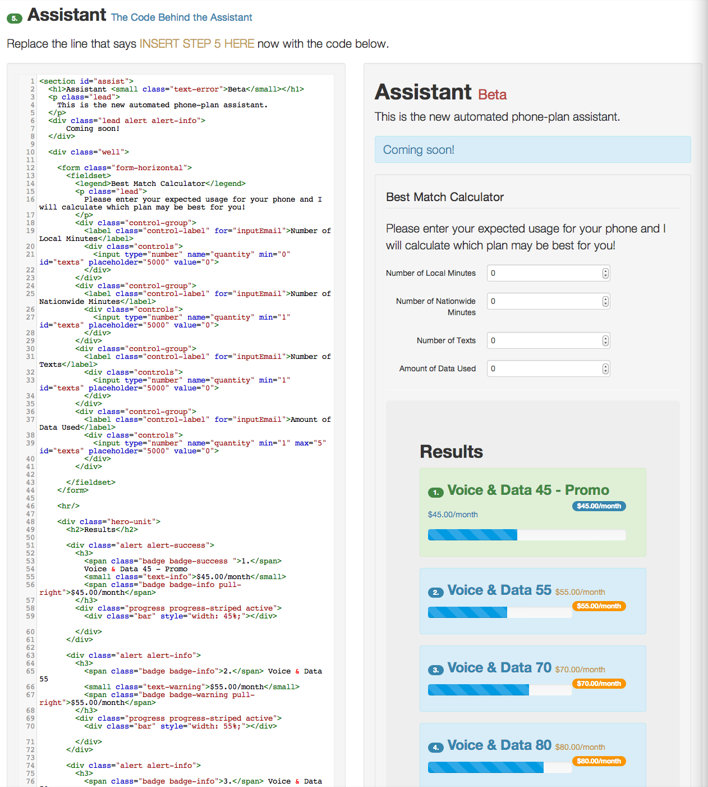

Hack-A-Week
===========

Saint Mary's High School Programming Competition re-styled.

The old style SMU programming competition can be found at http://cs.smu.ca/hspc/ 

-----

## SMU Hack-A-Week Hackathon
http://cs.smu.ca/hackaweek/

## Live Demo 2, Hosted on GitHub
http://glavin001.github.io/Hack-A-Week/ 

-----

## Screenshots

### Home

### Problem 2, Manual

### Problem 2, Solution

